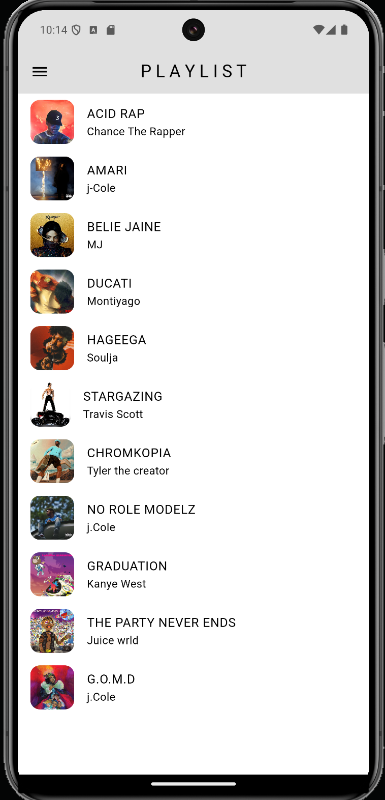
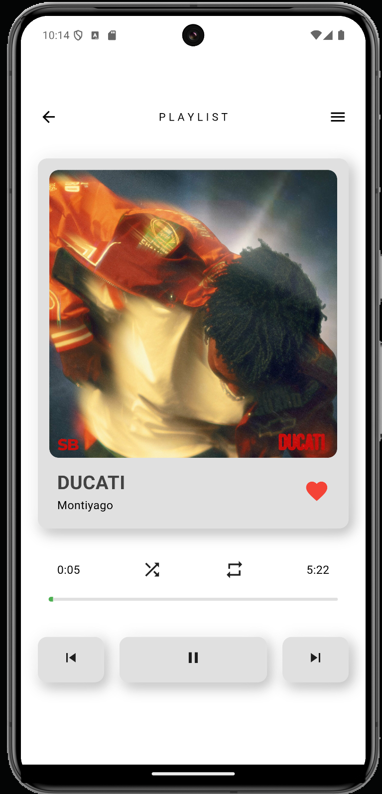
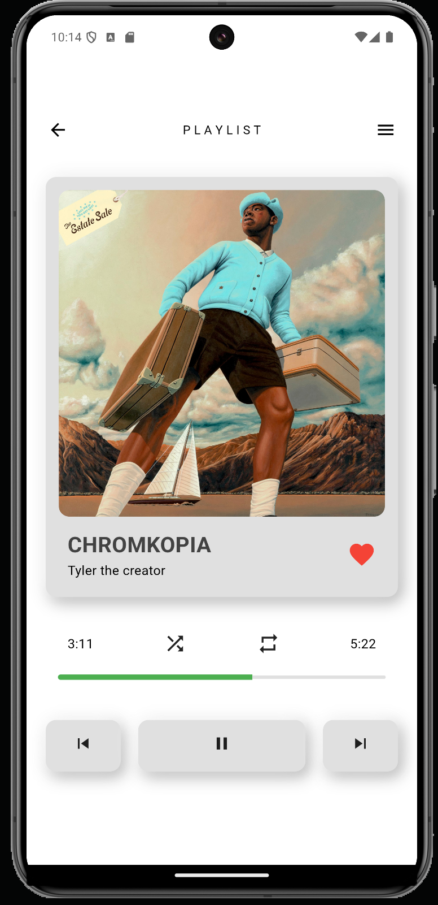
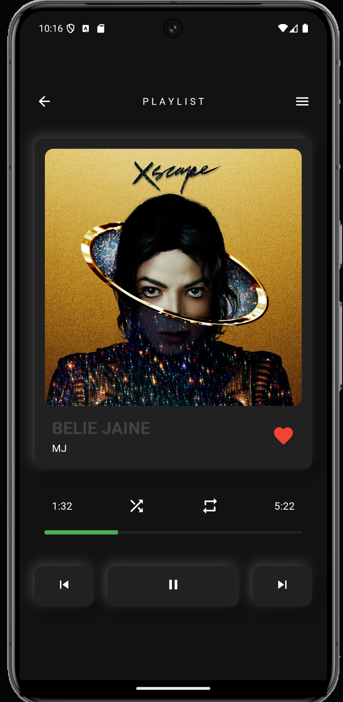
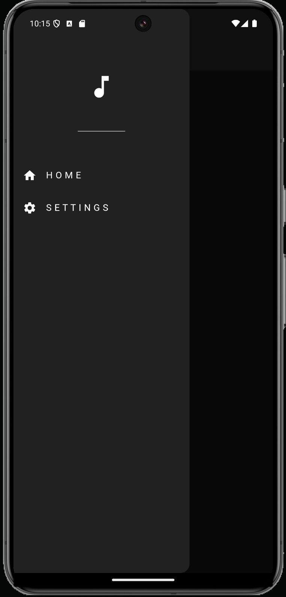

# Music Player

Overview
Minimal Music Player is a lightweight and intuitive music application built using Flutter. Designed with simplicity and functionality in mind, it provides users with a seamless and enjoyable music experience.

Features
State Management with GetX: Ensures a smooth and reactive user experience with minimal boilerplate code.
Dark Theme Mode: Includes a stylish dark theme for enhanced usability in low-light environments.
Minimalistic Design: Focused on a clean, clutter-free interface for effortless navigation and a user-centric experience.
# Screenshots
| | | | | 
|----------------|--------------|------------|----------|	
|	| | 
| |
# How to Run
Clone the repository:

git clone <repository_url>

Navigate to the project directory:

cd minimal_music_player

Install dependencies:

flutter pub get

Run the app:

flutter run

Future Enhancements
Adding playlist creation and management.
Integration with online music streaming services.
Equalizer and sound customization options.
Contact
For any questions or collaboration opportunities, feel free to reach out:

Email: mohmad0atif@gmail.com